# Product Requirements Document (PRD)
# InsightFlow — Self-Service AI Dashboard Penjualan Pakaian


## 1. Project Overview

### 1.1 Ringkasan Proyek

**InsightFlow** adalah platform e-commerce dan analitik *self-service* berbasis AI untuk **penjualan pakaian (fashion)**. Platform ini memungkinkan pengguna bisnis non-teknis untuk secara mandiri melihat, memahami, dan mengambil keputusan dari data penjualan — tanpa perlu keahlian teknis, tanpa query SQL, dan tanpa bergantung pada tim IT atau Data Analyst.

Platform ini memiliki tiga pilar utama:
1. **Halaman Toko (Front Page)** — Katalog produk pakaian dengan **AI Chat Assistant (streaming)** yang membantu customer bertanya produk, rekomendasi outfit, dan cek ketersediaan.
2. **Halaman Admin** — Seperti toko online pada umumnya: kelola produk, order, pembayaran, pengiriman, dan laporan.
3. **Asisten Monitoring via Telegram** — Setiap role sales dapat meminta data (laporan, performa) via Telegram dan menerima ringkasan harian otomatis setiap pukul **07.00** melalui **n8n scheduler**.

### 1.2 Ringkasan Eksekutif

| Atribut | Detail |
|---|---|
| **Nama Proyek** | InsightFlow — Self-Service AI Dashboard Penjualan Pakaian |
| **Tujuan Utama** | Platform penjualan pakaian dengan analitik AI self-service dan asisten chat cerdas |
| **Target Pengguna Utama** | Customer (pembeli), Sales, Manajer Penjualan, Admin |
| **Platform** | Web Application (Desktop-first) + Telegram Bot |
| **Tech Stack** | Next.js · Golang · n8n · PostgreSQL · Telegram Bot API |
| **Timeline MVP** | 3 Bulan |
| **Prioritas** | Tinggi |

---

## 2. Glosarium

Istilah-istilah teknis dan bisnis yang digunakan dalam dokumen ini:

| Istilah | Penjelasan |
|---|---|
| **Self-Service** | Pengguna dapat mengakses dan menganalisis data secara mandiri tanpa bantuan tim teknis |
| **Laporan / Report** | Sekumpulan data yang dipilih untuk divisualisasikan (dahulu disebut "dataset") |
| **Insight** | Ringkasan analitis berbahasa Indonesia yang dihasilkan AI untuk menjelaskan arti dari data |
| **Anomali** | Penyimpangan signifikan dari pola normal yang terdeteksi secara otomatis oleh AI |
| **Flag** | Tanda visual (ikon/warna) yang menandai adanya anomali atau masalah pada data |
| **AI Chat Assistant** | Fitur chat streaming di halaman depan yang membantu customer bertanya produk, rekomendasi, dan cek ketersediaan |
| **SSE** | *Server-Sent Events* — protokol streaming satu arah dari server ke client untuk chat real-time |
| **n8n** | Platform *workflow automation* open-source yang digunakan sebagai otak pemrosesan AI |
| **LLM** | *Large Language Model* — model AI bahasa besar yang digunakan untuk menghasilkan teks insight |
| **Webhook** | Mekanisme komunikasi antar sistem secara otomatis berbasis HTTP |
| **CRUD** | Create, Read, Update, Delete — operasi dasar pengelolaan data |
| **Threshold** | Batas nilai yang dikonfigurasi untuk memicu alert anomali (misal: penurunan > 10%) |
| **Varian Produk** | Kombinasi ukuran dan warna dari satu produk pakaian (misal: Kaos Polos - L - Hitam) |
| **tbl_** | Prefix nama tabel di database PostgreSQL |

---

## 3. Background & Konteks Bisnis

### 3.1 Situasi Saat Ini

Bisnis penjualan pakaian memiliki dinamika tinggi — tren fashion berubah cepat, perputaran stok harus gesit, dan customer membutuhkan respons cepat soal ketersediaan ukuran/warna. Namun, pengguna bisnis masih sangat bergantung pada tim IT untuk mengekstrak data dan membangun laporan. Siklus ini memakan waktu berhari-hari.

Customer juga tidak memiliki cara mudah untuk bertanya langsung soal produk — mereka harus mencari manual di katalog atau menghubungi sales satu per satu. Di sisi lain, manajer penjualan tidak mendapatkan notifikasi *real-time* ketika terjadi penyimpangan performa. Tim sales di lapangan juga kesulitan mengakses data performa mereka tanpa membuka dashboard di laptop.

### 3.2 Proses Bisnis Penjualan (Sumber Data)

Data yang dibaca oleh InsightFlow bersumber dari proses bisnis penjualan pakaian sehari-hari yang tersimpan di PostgreSQL. Seluruh transaksi dari proses di bawah ini **menulis** data ke database, dan InsightFlow hanya **membaca** data tersebut untuk analitik.

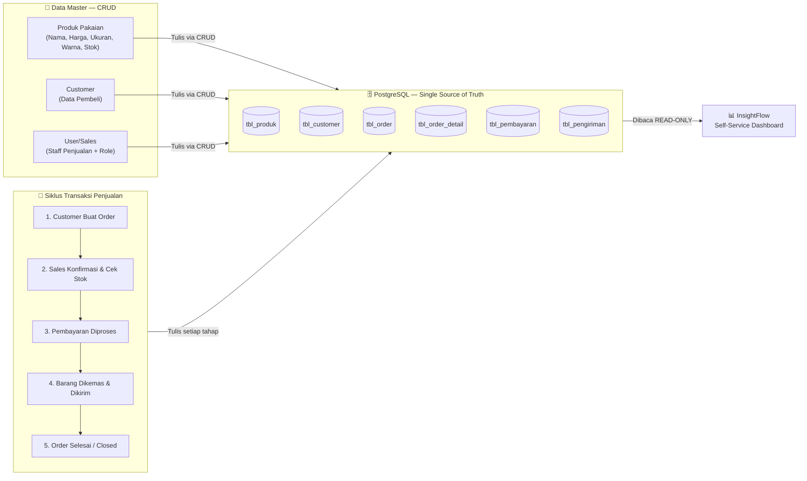

> [!NOTE]
> InsightFlow **tidak pernah menulis, mengubah, atau menghapus** data transaksi. Platform ini murni membaca (`SELECT`) data dari PostgreSQL untuk divisualisasikan dan dianalisis.

---

## 4. Problem Statement & Pain Points

### 4.1 Pernyataan Masalah Utama

> *"Pengguna bisnis memiliki akses ke banyak data, tetapi tidak memiliki cara yang mudah dan cepat untuk memahami apa yang data itu katakan — dan tidak mendapatkan peringatan ketika ada yang tidak beres."*

### 4.2 Pain Points per Persona

| Persona | Pain Point |
|---|---|
| **Customer** | Tidak ada cara mudah bertanya soal ketersediaan ukuran/warna, harus cari manual di katalog |
| **Sales** | Tidak bisa cek performa penjualan sendiri tanpa buka dashboard, sulit akses data via mobile |
| **Manajer Penjualan** | Tidak tahu performa harian tanpa buka laptop & buka sistem, tidak dapat peringatan otomatis |
| **Admin** | Harus minta bantuan IT setiap ingin melihat data, proses lama & bergantung |
| **Tim IT / Data Analyst** | Overwhelmed dengan permintaan laporan ad-hoc yang seharusnya bisa dilayani mandiri |

### 4.3 Detail Pain Points

- **Customer Tidak Terlayani 24/7:** Pertanyaan soal produk (ukuran, warna, bahan, ketersediaan) hanya bisa dijawab saat sales online.
- **Ketergantungan Tinggi:** Pengguna menunggu berhari-hari untuk permintaan *pull data* sederhana dari tim IT/Data.
- **Kompleksitas Alat:** Alat BI tradisional (Tableau, PowerBI) sangat kompleks, kurva pembelajaran curam untuk pengguna non-teknis.
- **Kebingungan Visualisasi:** Pengguna tidak tahu *chart* apa yang paling tepat merepresentasikan data mereka.
- **Kesenjangan Interpretasi:** Bahkan ketika grafik sudah tersedia, pengguna kesulitan mengidentifikasi anomali dan menarik kesimpulan bisnis yang *actionable*.
- **Tidak Ada Monitoring Proaktif:** Tim penjualan tidak mendapat peringatan dini ketika performa menurun.
- **Sales Tidak Bisa Akses Data Mandiri:** Sales harus bergantung pada manajer untuk tahu performa penjualan mereka sendiri.
- **Konteks Komunikasi Terputus:** Diskusi data bisnis terjadi di *platform* berbeda (email, WhatsApp) dengan tempat datanya berada.

---

## 5. Goals & Sasaran Keberhasilan

### 5.1 Tujuan Bisnis

1. Mengurangi ketergantungan pada tim IT/Data untuk permintaan laporan rutin sebesar **> 70%**.
2. Mempercepat waktu respons terhadap anomali penjualan dari hitungan **hari → menit**.
3. Memberikan visibilitas data harian kepada manajer dan sales **tanpa perlu login ke sistem** (via Telegram).
4. Meningkatkan konversi customer dengan menyediakan **AI Chat Assistant 24/7** di halaman toko.

### 5.2 Metrik Keberhasilan (KPI)

| Metrik | Target |
|---|---|
| Waktu pengguna menghasilkan laporan pertama | ≤ 5 menit sejak login |
| Jumlah klik untuk melihat laporan | ≤ 3 klik |
| Waktu respons AI Chat Assistant | ≤ 3 detik untuk mulai streaming |
| Waktu pengiriman Telegram daily summary | Setiap hari pukul 07.00, 0 miss |
| Waktu deteksi & notifikasi anomali ke Telegram | ≤ 15 menit setelah data masuk DB |
| Waktu respons Telegram Bot atas pertanyaan user | ≤ 10 detik |
| Tingkat kepuasan pengguna non-teknis (survei) | ≥ 4/5 bintang |

---

## 6. Solusi yang Diusulkan

### 6.1 Ringkasan Solusi

| # | Solusi | Penjelasan |
|---|---|---|
| 1 | **AI Chat Assistant (Streaming)** | Customer dapat bertanya langsung di halaman toko tentang produk pakaian, ketersediaan ukuran/warna, rekomendasi outfit. Jawaban AI di-stream secara real-time (SSE). |
| 2 | **Pilih Laporan Otomatis** | Pengguna memilih jenis laporan dari menu dropdown yang mudah dipahami (bukan query SQL). Sistem langsung mengambil data dari PostgreSQL. |
| 3 | **Auto-Visualisasi Cerdas** | AI mendeteksi tipe data dan secara otomatis memilih jenis chart yang paling tepat: Line Chart untuk data waktu, Funnel untuk tahapan, Pie/Bar untuk perbandingan kategori. |
| 4 | **AI Insight Generator** | Setiap laporan disertai ringkasan teks 2-3 kalimat dalam Bahasa Indonesia yang menjelaskan tren utama dan apa artinya bagi bisnis. |
| 5 | **Smart Anomaly Flagging** | AI mendeteksi penyimpangan signifikan (misal: penjualan turun >10% dari rata-rata) dan menandainya secara visual dengan ikon peringatan + penjelasan singkat. |
| 6 | **Rekomendasi Actionable** | Selain menandai masalah, AI memberikan saran tindakan konkret (misal: *"Penjualan Kaos Polos turun 20% — pertimbangkan promosi atau cek stok ukuran populer."*) |
| 7 | **Ekspor Laporan** | Pengguna dapat mengunduh tampilan dashboard sebagai PDF atau gambar untuk keperluan rapat. |
| 8 | **Telegram Daily Summary** | n8n secara otomatis mengirimkan ringkasan penjualan harian setiap pukul **07.00** ke grup/chat Telegram tim yang dikonfigurasi. |
| 9 | **Telegram Anomaly Alert** | Ketika anomali terdeteksi di data baru, n8n langsung mengirimkan pesan peringatan ke Telegram dalam < 15 menit. |
| 10 | **Telegram Q&A Bot (Per-Role)** | Setiap role (sales, manager) bisa bertanya langsung di Telegram sesuai cakupan datanya. Sales hanya bisa akses data sendiri, manager bisa akses semua. |

---

## 7. Tech Stack

| Layer | Teknologi | Versi | Alasan Pemilihan |
|---|---|---|---|
| **Frontend** | Next.js (React) | v14+ | SSR/SSG, routing dinamis, ekosistem chart (Recharts/ECharts), UX modern |
| **Backend** | Golang (Go) | v1.22+ | Performa tinggi, konkurensi via goroutines, efisien untuk aggregasi data besar |
| **AI Orchestration** | n8n | Latest (Self-hosted) | Visual workflow builder, modifikasi prompt tanpa re-deploy, integrasi LLM & Telegram plug-and-play |
| **Database** | PostgreSQL | v15+ | ACID-compliant, JSON support, Row Level Security, skalabel |
| **Bot & Notifikasi** | Telegram Bot API | v6+ | Familier, gratis, mendukung webhook dua arah, tidak perlu install app baru |
| **LLM** | OpenAI GPT-4o / Gemini | — | Kualitas bahasa Indonesia baik, tersedia via n8n node |
| **Reverse Proxy** | Nginx | Latest | HTTPS termination, routing `/api/*` ke Golang, `/*` ke Next.js |
| **Containerisasi** | Docker + Docker Compose | — | Deployment konsisten, mudah di-setup di server manapun |

---

## 8. Arsitektur Sistem

### 8.1 Gambaran Arsitektur (C4 Container Level)

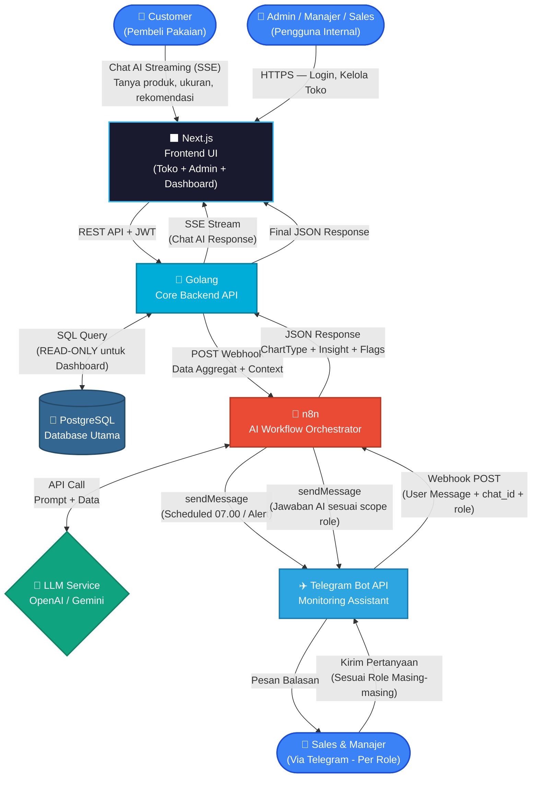

### 8.2 Penjelasan Alur Data

**Alur A — Customer AI Chat (Streaming):**
```
[Customer di Halaman Toko]
    │ Ketik pertanyaan di chat widget
    ▼
[Next.js] ──REST API──▶ [Golang]
                              │ Query katalog produk dari PostgreSQL
                              │ Susun context produk (stok, ukuran, warna)
                              ▼
                         [n8n Webhook]
                              │ Susun prompt LLM + data katalog
                              ▼
                         [LLM Service]
                              │ Stream response token by token
                              ▼
[Golang] ◀──SSE Stream── [n8n]
    │ Forward stream ke client
    ▼
[Next.js] ── Tampilkan jawaban AI secara real-time ──▶ [Customer]
```

**Alur B — Dashboard Analitik (Internal):**
```
[Pengguna Internal]
    │ Pilih Laporan (klik dropdown)
    ▼
[Next.js] ──REST API──▶ [Golang]
                              │ Query SQL aggregasi ke PostgreSQL
                              │ (Ambil data, hitung total, min, max, rata-rata)
                              ▼
                         [n8n Webhook]
                              │ Susun prompt LLM + kirim data aggregat
                              ▼
                         [LLM Service]
                              │ Return: chart_type, summary, anomalies, recommendation
                              ▼
                         [n8n Parser]
                              │ Format JSON baku
                              ▼
[Golang] ◀──JSON Response── [n8n]
    │ Gabungkan data point + AI config
    ▼
[Next.js] ── Render Chart + Teks Insight + Flag Anomali ──▶ [Pengguna Internal]
```

### 8.3 Deployment Overview

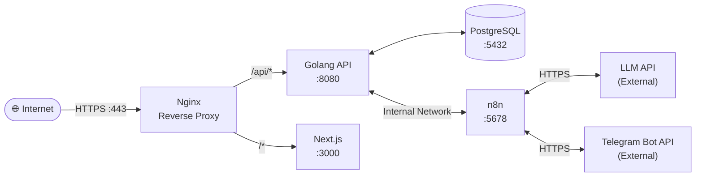

---

## 9. Model Data & Skema Database

### 9.1 Skema Database (Dua Schema Terpisah)

> [!IMPORTANT]
> Database PostgreSQL menggunakan **dua schema** terpisah untuk menjaga kejelasan: `app` untuk konfigurasi aplikasi, `bisnis` untuk data transaksi penjualan.

### 9.2 Schema `app` — Konfigurasi Aplikasi

```sql
-- Tabel pengguna aplikasi InsightFlow
CREATE TABLE app.users (
    id              UUID PRIMARY KEY DEFAULT gen_random_uuid(),
    nama            VARCHAR(100) NOT NULL,
    email           VARCHAR(150) UNIQUE NOT NULL,
    password        VARCHAR(255) NOT NULL,  -- bcrypt hash
    role            VARCHAR(50) NOT NULL,   -- 'admin', 'manager', 'sales', 'viewer'
    telegram_user_id BIGINT UNIQUE,          -- Mapping ke Telegram untuk Q&A per-role
    aktif           BOOLEAN DEFAULT TRUE,
    created_at      TIMESTAMP DEFAULT NOW()
);

-- Konfigurasi Telegram per grup/divisi
CREATE TABLE app.telegram_config (
    id          UUID PRIMARY KEY DEFAULT gen_random_uuid(),
    nama_grup   VARCHAR(100) NOT NULL,
    chat_id     BIGINT UNIQUE NOT NULL,  -- Telegram chat_id
    aktif       BOOLEAN DEFAULT TRUE,
    jam_summary TIME DEFAULT '07:00',   -- Jam pengiriman daily summary (07.00)
    threshold   DECIMAL(5,2) DEFAULT 10.00  -- % threshold anomali
);

-- Dashboard yang disimpan pengguna
CREATE TABLE app.saved_dashboards (
    id           UUID PRIMARY KEY DEFAULT gen_random_uuid(),
    user_id      UUID REFERENCES app.users(id),
    nama         VARCHAR(150) NOT NULL,
    konfigurasi  JSONB,   -- Simpan pilihan laporan & filter
    created_at   TIMESTAMP DEFAULT NOW()
);
```

### 9.3 Schema `bisnis` — Data Transaksi Penjualan

```sql
-- Master produk pakaian
CREATE TABLE bisnis.tbl_produk (
    id              SERIAL PRIMARY KEY,
    kode_produk     VARCHAR(50) UNIQUE NOT NULL,
    nama            VARCHAR(200) NOT NULL,
    kategori_pakaian VARCHAR(100),           -- 'atasan', 'bawahan', 'dress', 'outerwear', 'aksesoris'
    ukuran          VARCHAR(20),             -- 'S', 'M', 'L', 'XL', 'XXL', 'All Size'
    warna           VARCHAR(50),             -- 'Hitam', 'Putih', 'Merah', dll
    bahan           VARCHAR(100),            -- 'Katun', 'Polyester', 'Denim', dll
    harga           DECIMAL(15,2) NOT NULL,
    stok            INTEGER DEFAULT 0,
    aktif           BOOLEAN DEFAULT TRUE
);

-- Master customer
CREATE TABLE bisnis.tbl_customer (
    id          SERIAL PRIMARY KEY,
    kode_cust   VARCHAR(50) UNIQUE NOT NULL,
    nama        VARCHAR(200) NOT NULL,
    email       VARCHAR(150),
    telepon     VARCHAR(20),
    alamat      TEXT,
    created_at  TIMESTAMP DEFAULT NOW()
);

-- Header order
CREATE TABLE bisnis.tbl_order (
    id            SERIAL PRIMARY KEY,
    no_order      VARCHAR(50) UNIQUE NOT NULL,
    customer_id   INTEGER REFERENCES bisnis.tbl_customer(id),
    sales_id      UUID REFERENCES app.users(id),
    tanggal       DATE NOT NULL,
    status        VARCHAR(30) NOT NULL,  -- 'pending','confirmed','paid','shipped','closed','cancelled'
    total         DECIMAL(15,2),
    created_at    TIMESTAMP DEFAULT NOW()
);

-- Detail item per order
CREATE TABLE bisnis.tbl_order_detail (
    id          SERIAL PRIMARY KEY,
    order_id    INTEGER REFERENCES bisnis.tbl_order(id),
    produk_id   INTEGER REFERENCES bisnis.tbl_produk(id),
    qty         INTEGER NOT NULL,
    harga_saat  DECIMAL(15,2) NOT NULL,   -- Harga saat transaksi
    subtotal    DECIMAL(15,2) NOT NULL
);

-- Transaksi pembayaran
CREATE TABLE bisnis.tbl_pembayaran (
    id           SERIAL PRIMARY KEY,
    order_id     INTEGER REFERENCES bisnis.tbl_order(id),
    jumlah       DECIMAL(15,2) NOT NULL,
    metode       VARCHAR(50),             -- 'transfer', 'tunai', 'kartu'
    status       VARCHAR(30) NOT NULL,    -- 'pending', 'verified', 'rejected'
    tanggal      TIMESTAMP DEFAULT NOW()
);

-- Informasi pengiriman
CREATE TABLE bisnis.tbl_pengiriman (
    id           SERIAL PRIMARY KEY,
    order_id     INTEGER REFERENCES bisnis.tbl_order(id),
    kurir        VARCHAR(100),
    no_resi      VARCHAR(100),
    status       VARCHAR(30),             -- 'proses', 'dikirim', 'diterima'
    tanggal      TIMESTAMP DEFAULT NOW()
);
```

---

## 10. User Flow Lengkap

### 10.1 Alur AI Chat Assistant — Customer di Halaman Toko

*Customer bertanya langsung di halaman depan toko, AI menjawab secara streaming.*

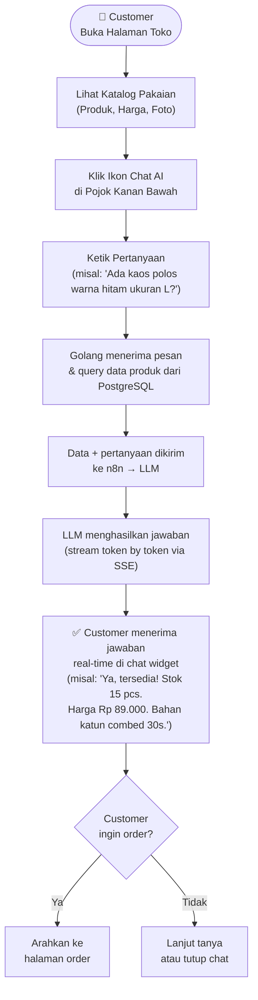

### 10.2 Alur Pembelian Pakaian oleh Customer

*Proses ini menghasilkan data yang akan dibaca oleh dashboard.*

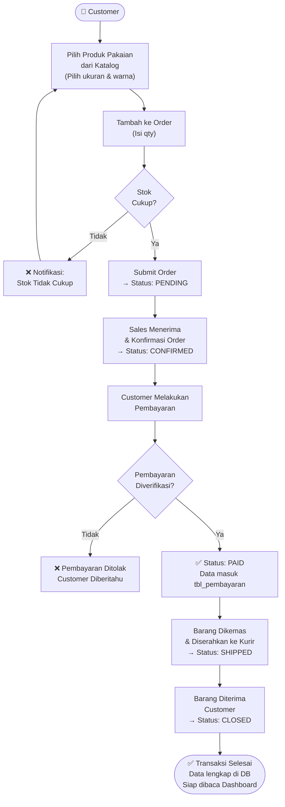

### 10.3 Alur Manajemen Data Master (CRUD)

*Dilakukan oleh Admin/Sales sebelum transaksi bisa berjalan.*

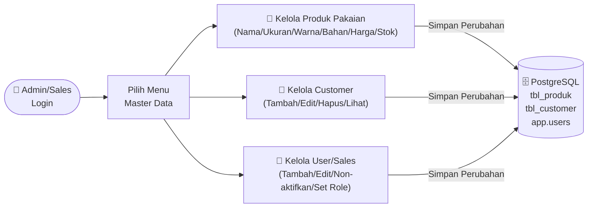

### 10.4 Alur Utama — Web Dashboard (Self-Service AI)

*Pengguna melihat laporan dan insight AI dari data yang sudah ada di database.*

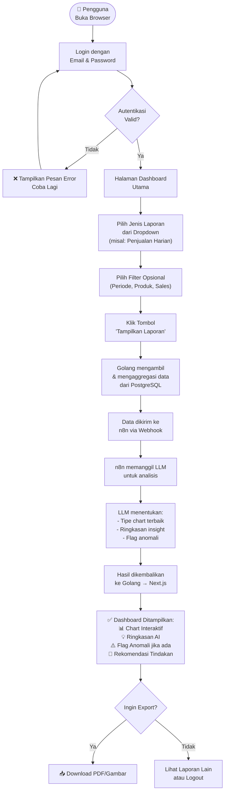

### 10.5 Alur Telegram — Daily Summary (Otomatis Terjadwal)

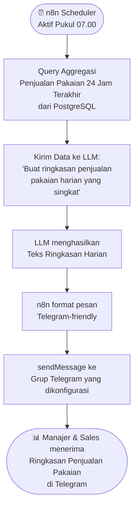

### 10.6 Alur Telegram — Anomaly Alert (Real-time)

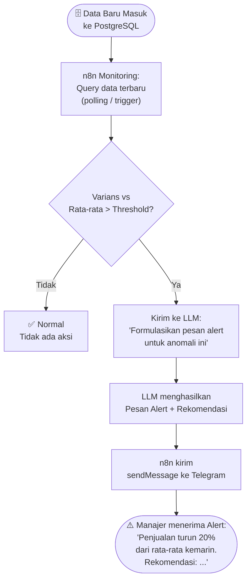

### 10.7 Alur Telegram — Q&A Interaktif Per-Role (User-Initiated)

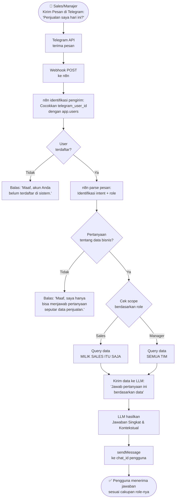
```

---

## 11. Scope & Batasan

> [!TIP]
> **Filosofi Produk:** "Pilih → Lihat → Mengerti" dalam 5 menit. Setiap fitur yang membutuhkan pelatihan lebih dari 5 menit untuk dipahami **tidak masuk** MVP.

### 11.1 In-Scope (MVP — Fase 1)

| No | Modul | Fitur | Prioritas |
|---|---|---|---|
| 1 | **Autentikasi** | Login dengan email & password, role-based access (`admin`, `manager`, `sales`, `viewer`) | 🔴 Critical |
| 2 | **Master Data** | CRUD Produk Pakaian (ukuran/warna/bahan), Customer, User/Sales | 🔴 Critical |
| 3 | **Transaksi** | Input order, konfirmasi, pembayaran, pengiriman | 🔴 Critical |
| 4 | **AI Chat Assistant** | Chat streaming (SSE) di halaman toko untuk customer: tanya produk, rekomendasi, cek stok | 🔴 Critical |
| 5 | **Dashboard** | Pilih laporan via dropdown, tampil chart otomatis | 🔴 Critical |
| 6 | **AI Insight** | Ringkasan teks otomatis per laporan | 🔴 Critical |
| 7 | **Anomaly Flag** | Deteksi & tampilkan visual anomali + rekomendasi | 🟠 High |
| 8 | **Export** | Download laporan sebagai PDF / Gambar | 🟡 Medium |
| 9 | **Telegram Daily** | Kirim ringkasan penjualan terjadwal tiap pagi pukul 07.00 | 🟠 High |
| 10 | **Telegram Alert** | Notifikasi anomali real-time ke Telegram | 🟠 High |
| 11 | **Telegram Q&A** | Bot per-role menjawab pertanyaan data bisnis via chat sesuai cakupan role | 🟡 Medium |

### 11.2 Out-of-Scope (Tidak Masuk MVP)

| Fitur | Alasan Ditunda |
|---|---|
| ETL pipeline / data cleansing manual | Kompleksitas tinggi, bukan kebutuhan inti pengguna |
| Custom SQL Query Editor untuk pengguna | Bertentangan dengan prinsip "non-teknis friendly" |
| Predictive forecasting (ML kompleks) | Scope terlalu besar untuk MVP |
| Kustomisasi estetis chart (warna, font, tema) | Tidak menambah nilai bisnis signifikan di MVP |
| Integrasi Slack / WhatsApp / Email | Telegram diprioritaskan dulu, bisa dikembangkan fase 2 |
| Multi-bahasa (Inggris / lainnya) | Bahasa Indonesia cukup untuk target pengguna awal |
| Mobile App (iOS/Android) | Web responsive dulu, app native di fase 2 |

---

## 12. Kebutuhan Fungsional

### 12.1 Modul Autentikasi

| ID | Kebutuhan |
|---|---|
| F-AUTH-01 | Sistem menyediakan halaman login dengan form email dan password |
| F-AUTH-02 | Sistem memvalidasi kredensial dan mengembalikan JWT token |
| F-AUTH-03 | Sistem membedakan hak akses berdasarkan role: `admin`, `manager`, `sales`, `viewer` |
| F-AUTH-04 | Sistem memblokir akses ke semua endpoint tanpa token valid |
| F-AUTH-05 | Sistem menyediakan fungsi logout yang menginvalidasi sesi |

### 12.2 Modul Master Data (CRUD)

| ID | Kebutuhan |
|---|---|
| F-MASTER-01 | Admin dapat menambah, mengedit, menonaktifkan, dan melihat data Produk Pakaian (nama, kategori, ukuran, warna, bahan, harga, stok) |
| F-MASTER-02 | Admin dapat menambah, mengedit, dan melihat data Customer |
| F-MASTER-03 | Admin dapat menambah, menonaktifkan, dan mengatur role User/Sales |
| F-MASTER-04 | Admin dapat mengisi `telegram_user_id` pada profil user untuk mengaktifkan akses Telegram per-role |
| F-MASTER-05 | Semua perubahan data master tersimpan ke PostgreSQL dengan timestamp |
| F-MASTER-06 | Produk yang dinonaktifkan tidak bisa dipilih saat input order baru |

### 12.3 Modul Transaksi Penjualan

| ID | Kebutuhan |
|---|---|
| F-TRX-01 | Sales dapat membuat order baru dengan memilih customer dan produk |
| F-TRX-02 | Sistem memvalidasi ketersediaan stok sebelum order dikonfirmasi |
| F-TRX-03 | Sales dapat mengonfirmasi order dan mengubah status ke `confirmed` |
| F-TRX-04 | Sistem mencatat pembayaran dan memvalidasi jumlah |
| F-TRX-05 | Sales dapat mencatat pengiriman dan nomor resi |
| F-TRX-06 | Sales dapat menandai order sebagai selesai (`closed`) |
| F-TRX-07 | Order dapat dibatalkan (`cancelled`) oleh admin/sales dengan alasan |

### 12.4 Modul AI Chat Assistant (Customer)

| ID | Kebutuhan |
|---|---|
| F-CHAT-01 | Halaman toko menampilkan widget chat AI di pojok kanan bawah yang dapat dibuka oleh customer |
| F-CHAT-02 | Customer dapat mengetik pertanyaan dalam Bahasa Indonesia tentang produk pakaian |
| F-CHAT-03 | Sistem mengambil data produk relevan dari PostgreSQL berdasarkan intent pertanyaan |
| F-CHAT-04 | Jawaban AI di-stream secara real-time menggunakan Server-Sent Events (SSE) |
| F-CHAT-05 | AI dapat menjawab tentang: ketersediaan stok, ukuran, warna, bahan, harga, dan rekomendasi outfit |
| F-CHAT-06 | AI menolak pertanyaan di luar konteks produk/toko dengan pesan yang ramah |
| F-CHAT-07 | Chat tidak memerlukan login (akses publik) |

### 12.5 Modul Dashboard Self-Service

| ID | Kebutuhan |
|---|---|
| F-DASH-01 | Pengguna dapat memilih jenis laporan dari daftar dropdown yang sudah tersedia |
| F-DASH-02 | Pengguna dapat memfilter laporan berdasarkan periode, produk, dan/atau sales |
| F-DASH-03 | Sistem secara otomatis mengambil data dari PostgreSQL sesuai pilihan laporan |
| F-DASH-04 | Sistem mengirim data ke n8n untuk dianalisis oleh AI |
| F-DASH-05 | AI menentukan jenis chart terbaik berdasarkan tipe data |
| F-DASH-06 | Laporan ditampilkan dengan chart interaktif yang bisa di-hover untuk detail |
| F-DASH-07 | Setiap laporan disertai ringkasan insight 2-3 kalimat dalam Bahasa Indonesia |
| F-DASH-08 | Anomali ditampilkan dengan ikon ⚠️ + teks penjelasan + rekomendasi tindakan |
| F-DASH-09 | Pengguna dapat mengunduh tampilan dashboard sebagai PDF atau gambar |

### 12.6 Modul Telegram Bot (Per-Role)

| ID | Kebutuhan |
|---|---|
| F-TG-01 | n8n mengirimkan ringkasan penjualan harian ke grup Telegram terkonfigurasi setiap pukul **07.00** |
| F-TG-02 | n8n mendeteksi anomali pada data terbaru dan mengirimkan alert ke Telegram dalam < 15 menit |
| F-TG-03 | Pesan alert berisi: nama metrik, nilai aktual, nilai ekspektasi, dan 1 rekomendasi |
| F-TG-04 | Bot menerima pesan dari pengguna dan mengidentifikasi role berdasarkan `telegram_user_id` di `app.users` |
| F-TG-05 | Bot membatasi scope data yang bisa ditanya sesuai role: `sales` hanya data sendiri, `manager` semua data |
| F-TG-06 | Bot menolak pertanyaan di luar konteks data bisnis dengan pesan yang ramah |
| F-TG-07 | Bot tidak merespons pesan dari `telegram_user_id` yang tidak terdaftar |
| F-TG-08 | Admin dapat mengonfigurasi chat_id grup, jam daily summary, dan threshold anomali melalui halaman Settings |

---

## 13. Kebutuhan Non-Fungsional

| Kategori | Kebutuhan | Target |
|---|---|---|
| **Performa** | Waktu load laporan dari klik sampai chart tampil | ≤ 5 detik |
| **Performa** | Waktu respons API Golang | ≤ 500ms untuk 95% request |
| **Performa** | Waktu respons Telegram Bot Q&A | ≤ 10 detik |
| **Keamanan** | Semua endpoint API menggunakan JWT authentication | 100% |
| **Keamanan** | Password disimpan dengan bcrypt hash | Wajib |
| **Keamanan** | Komunikasi menggunakan HTTPS (TLS 1.2+) | Wajib |
| **Keamanan** | Pengguna hanya bisa akses data sesuai role-nya | Role-based |
| **Ketersediaan** | Uptime aplikasi web | ≥ 99.5% |
| **Skalabilitas** | Mendukung hingga 50 pengguna aktif bersamaan | MVP target |
| **Kegunaan** | Pengguna non-teknis bisa navigasi tanpa manual | ≤ 5 menit onboarding |
| **Pemeliharaan** | Prompt LLM dapat diubah tanpa re-deploy backend | Via n8n UI |
| **Browser** | Mendukung Chrome, Firefox, Edge versi terbaru | Desktop-first |

---

## 14. User Stories

### 14.1 Kelompok: Customer (Pembeli)

| ID | User Story |
|---|---|
| US-01 | **Sebagai Customer**, saya ingin bisa bertanya langsung di halaman toko tentang ketersediaan ukuran dan warna pakaian agar saya tidak perlu menghubungi sales secara manual. |
| US-02 | **Sebagai Customer**, saya ingin mendapat rekomendasi outfit dari AI berdasarkan produk yang saya lihat agar saya lebih mudah memilih. |
| US-03 | **Sebagai Customer**, saya ingin jawaban AI muncul secara real-time (streaming) agar pengalaman chat terasa responsif dan alami. |

### 14.2 Kelompok: Admin Sistem

| ID | User Story |
|---|---|
| US-04 | **Sebagai Admin**, saya ingin dapat menambahkan produk pakaian baru (dengan ukuran, warna, bahan) ke sistem agar produk tersebut bisa dimasukkan ke dalam order penjualan. |
| US-05 | **Sebagai Admin**, saya ingin mengedit harga dan stok produk pakaian agar data yang digunakan dalam transaksi selalu akurat. |
| US-06 | **Sebagai Admin**, saya ingin menonaktifkan produk yang tidak lagi dijual agar tidak muncul di pilihan order. |
| US-07 | **Sebagai Admin**, saya ingin mengelola data customer (tambah/edit) agar informasi pembeli tersimpan dengan lengkap. |
| US-08 | **Sebagai Admin**, saya ingin menambah dan menonaktifkan akun Sales serta mengatur role-nya agar hak akses tim selalu terkelola dengan baik. |
| US-09 | **Sebagai Admin**, saya ingin mengisi telegram_user_id pada profil user agar setiap user bisa mengakses data via Telegram sesuai role-nya. |
| US-10 | **Sebagai Admin**, saya ingin mengonfigurasi grup Telegram dan jam pengiriman daily summary (default 07.00) agar bot berjalan sesuai kebutuhan tim. |

### 14.3 Kelompok: Sales / Staff Operasional

| ID | User Story |
|---|---|
| US-11 | **Sebagai Sales**, saya ingin membuat order baru untuk customer dengan memilih produk pakaian (termasuk ukuran dan warna) dari daftar agar proses pemesanan cepat. |
| US-12 | **Sebagai Sales**, saya ingin dikonfirmasi oleh sistem jika stok produk tidak cukup sebelum order disubmit agar tidak ada order yang tidak bisa dipenuhi. |
| US-13 | **Sebagai Sales**, saya ingin mencatat pembayaran customer dan mengubah status order agar alur transaksi tercatat lengkap di sistem. |
| US-14 | **Sebagai Sales**, saya ingin mencatat nomor resi pengiriman agar status pengiriman bisa dilacak. |
| US-15 | **Sebagai Sales**, saya ingin bertanya di Telegram tentang performa penjualan saya hari ini agar saya bisa memantau target tanpa buka dashboard. |

### 14.4 Kelompok: Manajer Penjualan

| ID | User Story |
|---|---|
| US-16 | **Sebagai Manajer**, saya ingin membuka dashboard dan memilih "Laporan Penjualan Harian" dari menu dropdown agar saya bisa langsung melihat performa tanpa perlu tahu cara query data. |
| US-17 | **Sebagai Manajer**, saya ingin sistem secara otomatis menampilkan jenis grafik yang paling tepat sesuai data agar saya tidak salah menginterpretasikan informasi. |
| US-18 | **Sebagai Manajer**, saya ingin membaca ringkasan AI dalam Bahasa Indonesia di bawah setiap grafik agar saya bisa langsung mengerti tren tanpa harus menganalisis sendiri. |
| US-19 | **Sebagai Manajer**, saya ingin melihat tanda peringatan ⚠️ jika ada penurunan penjualan signifikan agar saya bisa dengan cepat melihat masalah tanpa harus membaca semua angka. |
| US-20 | **Sebagai Manajer**, saya ingin mendapat rekomendasi tindakan dari AI ketika ada anomali agar saya punya arahan awal dalam mengatasi masalah. |
| US-21 | **Sebagai Manajer**, saya ingin mengunduh hasil laporan sebagai PDF agar bisa saya bagikan langsung di rapat. |

### 14.5 Kelompok: Telegram Bot (Monitoring Penjualan Per-Role)

| ID | User Story |
|---|---|
| US-22 | **Sebagai Manajer**, saya ingin menerima ringkasan penjualan harian setiap pukul 07.00 di Telegram agar saya tahu kondisi bisnis bahkan sebelum membuka laptop. |
| US-23 | **Sebagai Manajer**, saya ingin mendapat notifikasi otomatis di Telegram ketika ada penurunan penjualan signifikan agar saya bisa merespons masalah secara *real-time*. |
| US-24 | **Sebagai Manajer**, saya ingin bisa bertanya di Telegram (misal: *"Total penjualan semua sales minggu ini?"*) dan mendapat jawaban dari seluruh data tim. |
| US-25 | **Sebagai Sales**, saya ingin bisa bertanya di Telegram (misal: *"Penjualan saya hari ini berapa?"*) dan mendapat jawaban hanya dari data penjualan saya sendiri. |

---

## 15. Acceptance Criteria

### 15.1 Modul Autentikasi

- [ ] Pengguna dengan kredensial valid bisa login dan mendapat JWT token dalam ≤ 2 detik.
- [ ] Pengguna dengan kredensial salah mendapat pesan error yang jelas (bukan pesan teknis).
- [ ] Pengguna dengan role `viewer` tidak bisa mengakses menu CRUD Master Data.
- [ ] Token yang kedaluwarsa secara otomatis mengarahkan pengguna ke halaman login.

### 15.2 Modul Master Data

- [ ] Admin dapat menambah produk pakaian baru dengan field: nama, kategori, ukuran, warna, bahan, harga, stok; produk langsung muncul di dropdown order baru.
- [ ] Produk yang dinonaktifkan tidak muncul di pilihan order baru.
- [ ] Semua field wajib (nama produk, harga, kategori_pakaian) divalidasi — tidak boleh kosong.

### 15.3 Modul AI Chat Assistant

- [ ] Widget chat muncul di halaman toko dan bisa dibuka tanpa login.
- [ ] Customer mengetik pertanyaan dan respons mulai streaming dalam ≤ 3 detik.
- [ ] AI menjawab dengan benar tentang ketersediaan produk berdasarkan data aktual di database.
- [ ] Pertanyaan di luar konteks produk mendapat balasan ramah yang mengarahkan kembali.
- [ ] Chat berfungsi lancar pada browser Chrome, Firefox, dan Edge versi terbaru.

### 15.4 Modul Transaksi

- [ ] Saat order dibuat dengan produk yang stoknya 0, sistem menampilkan error dan TIDAK menyimpan order.
- [ ] Setiap perubahan status order (pending → confirmed → paid → shipped → closed) tersimpan dengan timestamp.
- [ ] Data pembayaran yang berhasil dikonfirmasi langsung mengubah status order menjadi `paid`.

### 15.5 Modul Dashboard

- [ ] Pengguna dapat memilih laporan dari dropdown dan melihat chart dalam ≤ 3 klik dari halaman utama.
- [ ] Untuk data *time-series* (penjualan per hari/minggu/bulan) → sistem memilih **Line Chart**.
- [ ] Untuk data perbandingan kategori (penjualan per produk/sales) → sistem memilih **Bar Chart** atau **Pie Chart**.
- [ ] Untuk data tahapan (funnel order: pending → confirmed → paid → closed) → sistem memilih **Funnel Chart**.
- [ ] Setiap chart disertai ringkasan insight AI 2-3 kalimat dalam Bahasa Indonesia yang relevan dengan data.
- [ ] Jika ada varians antar periode > 10% (default), ikon ⚠️ ditampilkan dengan penjelasan dan 1 rekomendasi.
- [ ] Tombol "Download PDF" mengunduh file PDF yang berisi chart + insight dalam ≤ 5 detik.
- [ ] Pengguna non-teknis tanpa pengalaman BI dapat menggunakan dashboard dari login hingga membaca insight dalam **≤ 5 menit**.

### 15.6 Modul Telegram Bot

- [ ] Daily summary dikirim tepat pukul **07.00** (±2 menit toleransi) ke grup yang dikonfigurasi.
- [ ] Alert anomali dikirim dalam **≤ 15 menit** setelah data anomali terdeteksi.
- [ ] Format pesan alert: `⚠️ [Nama Metrik]: [Nilai Aktual] vs [Ekspektasi]. Rekomendasi: [teks]`.
- [ ] Bot mengidentifikasi pengirim berdasarkan `telegram_user_id` dan menentukan scope data sesuai role.
- [ ] Sales hanya mendapat jawaban dari data miliknya sendiri; Manager mendapat jawaban dari semua data tim.
- [ ] Bot merespons pertanyaan dalam **≤ 10 detik**.
- [ ] Pertanyaan di luar topik data bisnis mendapat balasan: *"Maaf, saya hanya bisa menjawab pertanyaan seputar data penjualan kami."*
- [ ] Bot tidak merespons pesan dari `telegram_user_id` yang tidak terdaftar di `app.users`.

---

## 16. Prinsip UI/UX

> [!IMPORTANT]
> Desain UI wajib dirancang untuk **pengguna non-teknis**. Tidak boleh ada elemen yang membutuhkan pelatihan khusus untuk dipahami.

1. **Simpel di atas segalanya:** Maksimal 3 klik untuk mencapai informasi apapun.
2. **Plain Language:** Semua label, tombol, dan teks menggunakan Bahasa Indonesia sehari-hari. Tidak ada jargon teknis (tidak ada kata "query", "dataset", "schema").
3. **Visual Hierarchy Jelas:** Informasi terpenting (ringkasan insight, flag anomali) harus paling pertama terlihat oleh mata.
4. **Error yang Ramah:** Setiap error ditampilkan dengan pesan yang bisa dimengerti dan memberi tahu pengguna apa yang harus dilakukan selanjutnya.
5. **Tidak Ada Menu Bersarang:** Navigasi maksimal 2 level (menu utama → sub-halaman). Tidak ada sub-sub-menu.
6. **Responsif Desktop:** Dioptimalkan untuk layar desktop/laptop. Mobile menjadi bonus, bukan kewajiban MVP.

---

## 17. Risiko & Mitigasi

| # | Risiko | Dampak | Kemungkinan | Mitigasi |
|---|---|---|---|---|
| 1 | LLM menghasilkan insight tidak akurat / menyesatkan | Tinggi | Sedang | Sertakan catatan "Insight dihasilkan AI, selalu verifikasi dengan data asli" + pilih model dengan performa Bahasa Indonesia baik |
| 2 | Biaya API LLM membengkak | Sedang | Sedang | Gunakan data aggregat (bukan raw data) yang dikirim ke LLM, batasi karakter input, pertimbangkan LLM lokal (Ollama) di fase 2 |
| 3 | Telegram Bot diblokir / rate-limited | Sedang | Rendah | Implementasi retry logic di n8n, monitor delivery status |
| 4 | n8n down = semua fitur AI & Telegram mati | Tinggi | Rendah | Deploy n8n dengan Docker + auto-restart, pisahkan dari server utama jika memungkinkan |
| 5 | Pengguna non-teknis tetap kesulitan menggunakan UI | Tinggi | Sedang | Lakukan user testing dengan 3-5 pengguna target sebelum go-live, iterasi UI berdasarkan feedback |
| 6 | Data sensitif bocor ke LLM eksternal | Tinggi | Rendah | Kirim hanya data aggregat/statistik, bukan data personal customer, review payload sebelum produksi |

---

## 18. Roadmap & Fase Pengembangan

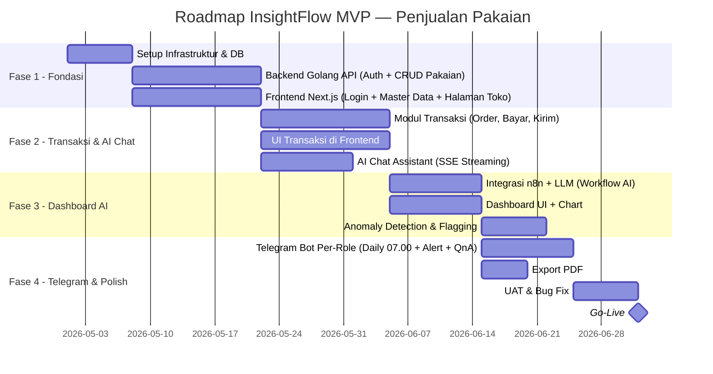

### Ringkasan Fase

| Fase | Durasi | Output |
|---|---|---|
| **Fase 1 — Fondasi** | 2 Minggu | Setup server, DB schema pakaian, API autentikasi, CRUD master data, halaman toko |
| **Fase 2 — Transaksi & AI Chat** | 2 Minggu | Input order pakaian, pembayaran, pengiriman, AI Chat Assistant streaming di halaman toko |
| **Fase 3 — Dashboard AI** | 2 Minggu | Laporan otomatis, chart, insight AI, anomaly detection |
| **Fase 4 — Telegram & Polish** | 2 Minggu | Telegram Bot per-role (daily 07.00), export PDF, UAT, go-live |
| **Total MVP** | **~8 Minggu** | Platform siap pakai end-to-end |

---

## 19. Definition of Done

Sebuah fitur dinyatakan **selesai** jika memenuhi seluruh kriteria berikut:

### Kode & Teknis
- [ ] Semua kebutuhan fungsional pada bagian 12 terimplementasi sesuai spesifikasi
- [ ] Semua acceptance criteria pada bagian 15 terpenuhi
- [ ] API endpoint terdokumentasi (minimal via Postman Collection)
- [ ] Tidak ada *critical bug* yang belum terselesaikan

### Fungsional End-to-End
- [ ] Pengguna dapat login, kelola data master pakaian, input transaksi, dan lihat dashboard dengan AI insight
- [ ] Customer dapat chat dengan AI Assistant di halaman toko dan mendapat jawaban streaming tentang produk pakaian
- [ ] Anomali pada data ditandai secara visual di dashboard
- [ ] n8n Workflow berhasil memanggil LLM dan mengembalikan konfigurasi chart + insight yang akurat
- [ ] Telegram Bot mengirimkan daily summary terjadwal setiap pukul 07.00
- [ ] Telegram Bot mengirimkan alert anomali dalam < 15 menit setelah deteksi
- [ ] Telegram Bot merespons pertanyaan pengguna sesuai scope role masing-masing dalam < 10 detik

### Kualitas & Ketersediaan
- [ ] Seluruh alur utama telah melalui User Acceptance Testing (UAT) dengan minimal 3 pengguna non-teknis
- [ ] Aplikasi berjalan stabil di atas stack: **Golang API + Next.js + n8n + PostgreSQL + Nginx**
- [ ] Tidak ada data personal customer yang terekspos ke layanan LLM eksternal

---

*Dokumen ini adalah living document. Perubahan signifikan wajib melalui review Product Manager dan disetujui stakeholder sebelum diimplementasikan.*
