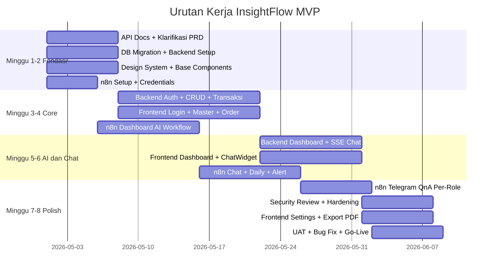

# InsightFlow — Work Breakdown Index

> **Proyek:** InsightFlow Self-Service AI Dashboard Penjualan Pakaian  
> **Versi Dokumen:** v1.0  
> **Terakhir Diperbarui:** April 2026

---

## Tentang Dokumen Ini

Folder `breakdown/` berisi detail pengerjaan setiap area dari Work Breakdown Structure (WBS) proyek InsightFlow. Setiap file merupakan panduan teknis dan operasional untuk satu area pengerjaan.

---

## Daftar Area Breakdown

| Area | File | Deskripsi Singkat |
|---|---|---|
| **Area 1** | [area-1-api-documentation.md](./area-1-api-documentation.md) | Kontrak API, format standar, daftar endpoint, deliverables dokumentasi |
| **Area 2** | [area-2-product-requirements.md](./area-2-product-requirements.md) | Klarifikasi PRD, pertanyaan stakeholder, daftar laporan dashboard |
| **Area 3** | [area-3-backend-architecture.md](./area-3-backend-architecture.md) | Setup Golang Fiber, DB migration, Auth, Master Data, Transaksi, AI integration |
| **Area 4** | [area-4-frontend-uiux.md](./area-4-frontend-uiux.md) | Setup Next.js, Design System, semua halaman & komponen |
| **Area 5** | [area-5-security.md](./area-5-security.md) | Auth, Authorization, Input Validation, Data Protection, Infrastructure |
| **Area 6** | [area-6-n8n-ai-workflows.md](./area-6-n8n-ai-workflows.md) | 5 workflow n8n: Dashboard AI, Chat SSE, Telegram Daily, Alert, Q&A |

---

## Urutan Pengerjaan (Gantt Overview)



---

## Dependency Map

```
Area 1 (API Docs) ──→ Area 3 Backend (mulai coding)
                  ──→ Area 4 Frontend (mock data dulu)

Area 3 (DB Migration) ──→ Area 3 Backend CRUD
                          ──→ Area 6 n8n (PostgreSQL nodes)
                          ──→ Area 4 Frontend (data real)

Area 6 (n8n Workflow Dashboard) ──→ Area 3 Backend /reports (integrasi)
                                    ──→ Area 4 Frontend Dashboard

Area 6 (n8n Workflow Chat) ──→ Area 3 Backend SSE /chat/stream
                                ──→ Area 4 Frontend ChatWidget

Area 6 (n8n Workflow Telegram) ──→ Independent, paralel setelah DB siap

Area 5 (Security Review) ──→ Setelah semua fitur core selesai
                         ──→ Sebelum UAT dan go-live
```

---

## Dokumen Terkait

| Dokumen | Lokasi |
|---|---|
| PRD Lengkap | [Self_Service_AI_Dashboard_PRD.md](../Self_Service_AI_Dashboard_PRD.md) |
| Work Breakdown Utama | [work_breakdown.md](../work_breakdown.md) |

---

*Folder ini adalah bagian dari living document InsightFlow. Update setiap ada perubahan scope atau teknis.*
