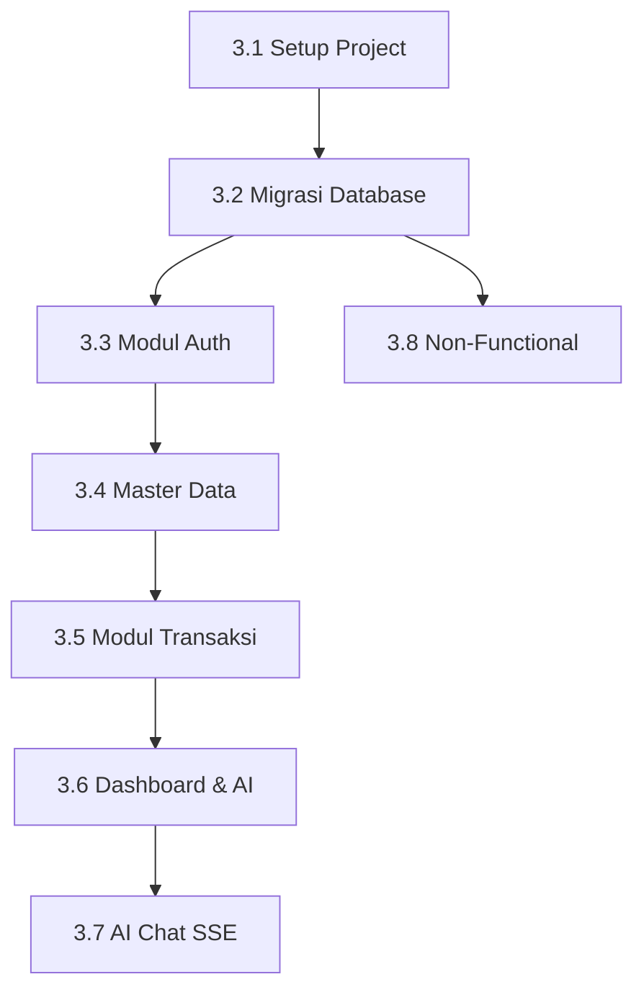

# Area 3 — Technical Architecture & Backend (Golang Fiber)

> **Tujuan:** Membangun fondasi teknis backend yang solid, scalable, dan siap untuk integrasi AI melalui n8n.

---

## 3.1 Setup Proyek

- [ ] Init **Go Fiber** project
- [ ] Struktur folder:

```
/cmd
/internal
  /handler
  /service
  /repository
  /middleware
  /domain
/config
/db/migrations
```

- [ ] Konfigurasi via `.env`:
  - `DB_DSN` — PostgreSQL connection string
  - `JWT_SECRET` — minimal 32 karakter
  - `N8N_URL` — URL internal n8n webhook
  - `TELEGRAM_TOKEN` — Token Telegram Bot
- [ ] PostgreSQL connection pool menggunakan `pgxpool`
- [x] Database migration tool: `golang-migrate`

---

## 3.2 Migrasi Database

### Schema `app` (Konfigurasi Aplikasi)

- [ ] `app.users` — dengan field `role`, `telegram_user_id`
- [ ] `app.telegram_config` — `jam_summary DEFAULT '07:00'`
- [ ] `app.saved_dashboards`

### Schema `bisnis` (Data Transaksi)

- [ ] `bisnis.tbl_produk` — dengan `kategori_pakaian`, `ukuran`, `warna`, `bahan`
- [ ] `bisnis.tbl_customer`
- [ ] `bisnis.tbl_order`
- [ ] `bisnis.tbl_order_detail`
- [ ] `bisnis.tbl_pembayaran`
- [ ] `bisnis.tbl_pengiriman`

### Indexing

- [ ] `tbl_order(tanggal)` — untuk query laporan berdasarkan periode
- [ ] `tbl_order(sales_id)` — untuk filter per sales
- [ ] `tbl_order(status)` — untuk filter status order
- [ ] `tbl_produk(kategori_pakaian)` — untuk filter per kategori
- [ ] `users(telegram_user_id)` — untuk lookup Telegram Q&A

### Seeder Data

- [ ] Produk pakaian dummy (berbagai kategori, ukuran, warna)
- [ ] User dummy (admin, manager, sales)
- [ ] Customer dummy

---

## 3.3 Modul Auth

| Task | Detail |
|---|---|
| `POST /auth/login` | Validasi email + password, return JWT (httpOnly cookie atau bearer token) |
| `POST /auth/logout` | Invalidasi token |
| `GET /auth/me` | Profil dari JWT claim |
| Middleware `AuthRequired` | Validasi JWT di setiap request |
| Middleware `RoleGuard(roles ...string)` | Cek role dari JWT claim |

**Konfigurasi JWT:**
- Algoritma: HS256
- Expiry: 8 jam
- Secret: dari `.env` (minimal 32 karakter)

- [ ] `POST /auth/login` — validasi, return JWT
- [ ] `POST /auth/logout` — invalidasi token
- [ ] `GET /auth/me` — profil dari JWT claim
- [ ] Middleware `AuthRequired`
- [ ] Middleware `RoleGuard(roles ...string)`

---

## 3.4 Modul Master Data (Admin Only)

- [ ] **CRUD Produk** — soft-delete (`aktif = false`), bukan hard delete
- [ ] **CRUD Customer**
- [ ] **CRUD User/Sales** — set role + `telegram_user_id`
- [ ] `GET /produk?aktif=true` — untuk dropdown di form order baru

> [!NOTE]
> Produk dengan `aktif = false` tetap tersimpan di DB (untuk historis order) tapi tidak muncul di dropdown order baru.

---

## 3.5 Modul Transaksi

| Endpoint | Action | Catatan |
|---|---|---|
| `POST /orders` | Buat order baru | Validasi stok, atomic transaction (order + detail) |
| `POST /orders/:id/confirm` | Ubah status → `confirmed` | Hanya Sales/Admin |
| `POST /payments` | Catat pembayaran | — |
| `POST /payments/:id/verify` | Verifikasi pembayaran → `paid` | Hanya Admin |
| `POST /shipments` | Catat nomor resi pengiriman | — |
| `PUT /shipments/:id` | Update status → `diterima` / `closed` | — |
| `POST /orders/:id/cancel` | Batalkan order | Wajib sertakan alasan |

- [ ] `POST /orders` — buat order, validasi stok, atomic transaction (order + detail)
- [ ] `POST /orders/:id/confirm` → status: confirmed
- [ ] `POST /payments` → catat pembayaran
- [ ] `POST /payments/:id/verify` → status: paid
- [ ] `POST /shipments` → catat resi
- [ ] `PUT /shipments/:id` → status: diterima / closed
- [ ] `POST /orders/:id/cancel` → status: cancelled + alasan

> [!IMPORTANT]
> `POST /orders` harus menggunakan **database transaction**. Jika insert ke `tbl_order_detail` gagal, `tbl_order` harus di-rollback agar tidak ada header order tanpa detail.

---

## 3.6 Modul Dashboard & AI

**Alur Integrasi:**
```
GET /reports → Golang aggregasi SQL → POST ke n8n webhook
    → LLM analisis → n8n response → Golang gabungkan → Return ke Frontend
```

Komponen respons dari n8n:
- `chart_type` — jenis chart yang direkomendasikan AI
- `summary` — ringkasan 2-3 kalimat Bahasa Indonesia
- `anomalies[]` — daftar anomali yang terdeteksi
- `recommendation` — satu rekomendasi tindakan

- [ ] `GET /reports?type=&from=&to=&sales_id=` — aggregasi SQL per tipe laporan
- [ ] POST ke n8n webhook dengan data aggregat
- [ ] Terima response: `chart_type`, `summary`, `anomalies`, `recommendation`
- [ ] Gabung data + AI response → return JSON ke frontend

---

## 3.7 Modul AI Chat (SSE)

**Alur:**
```
GET /chat/stream?message= → Query produk dari DB → POST ke n8n chat
    → n8n call LLM → Forward stream via SSE ke client
```

- [ ] `GET /chat/stream?message=` — SSE endpoint
- [ ] Header yang wajib di-set:
  - `Content-Type: text/event-stream`
  - `Cache-Control: no-cache`
- [ ] Query produk relevan dari DB berdasarkan keyword
- [ ] Kirim ke n8n chat workflow → forward stream ke client

---

## 3.8 Non-Functional Requirements

- [ ] **Rate limiting** per IP (gunakan Fiber middleware bawaan)
- [ ] **Request timeout** 30 detik
- [ ] **Structured logging** menggunakan `zerolog`
- [ ] **Health check** `GET /health` — untuk uptime monitoring
- [ ] **Graceful shutdown** — SIGTERM handler

---

## Dependency & Urutan Pengerjaan



> [!TIP]
> Selesaikan **3.1 - 3.3** terlebih dahulu sebelum frontend mulai. Frontend bisa menggunakan mock data sementara migration dan auth belum selesai.
