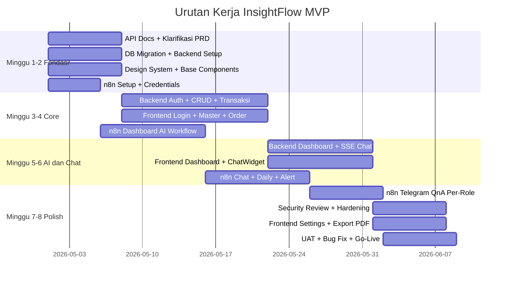

# Work Breakdown — InsightFlow Self-Service AI Dashboard Penjualan Pakaian

---

## Area 1 — API Documentation

**Tujuan:** Seluruh kontrak API terdefinisi sebelum implementasi agar frontend & backend bisa paralel.

### 1.1 Format & Standar

- [ ] Setup Postman Collection atau OpenAPI 3.0 (Swagger UI)
- [ ] Base URL + versioning: `/api/v1/`
- [ ] Format respons standar:

```json
{ "success": true, "message": "...", "data": {}, "errors": null }
```

- [ ] Format error: 400 Validation, 401 Unauthenticated, 403 Forbidden, 404 Not Found, 409 Conflict, 500 Server Error

### 1.2 Daftar Endpoint

| Group | Endpoint | Method | Role |
|---|---|---|---|
| Auth | `/auth/login` | POST | Public |
| Auth | `/auth/logout` | POST | Auth |
| Auth | `/auth/me` | GET | Auth |
| Produk | `/produk` | GET, POST | Auth |
| Produk | `/produk/:id` | GET, PUT, PATCH | Auth |
| Customer | `/customer` | GET, POST | Auth |
| Customer | `/customer/:id` | GET, PUT | Auth |
| Users | `/users` | GET, POST | Admin |
| Users | `/users/:id` | GET, PUT, PATCH | Admin |
| Order | `/orders` | GET, POST | Auth |
| Order | `/orders/:id` | GET | Auth |
| Order | `/orders/:id/confirm` | POST | Sales/Admin |
| Order | `/orders/:id/cancel` | POST | Sales/Admin |
| Pembayaran | `/payments` | POST | Sales/Admin |
| Pembayaran | `/payments/:id/verify` | POST | Admin |
| Pengiriman | `/shipments` | POST | Sales/Admin |
| Pengiriman | `/shipments/:id` | PUT | Sales/Admin |
| Dashboard | `/reports?type=&from=&to=` | GET | Manager/Admin |
| AI Chat | `/chat/stream?message=` | GET (SSE) | Public |
| Settings | `/settings/telegram` | GET, PUT | Admin |
| Internal n8n | `/internal/ai-result` | POST | Internal |

### 1.3 Deliverables
- [ ] Postman Collection `.json` di-commit ke repo
- [ ] Swagger UI dihosting di `/api/docs`
- [ ] Contoh request + response per endpoint
- [ ] Dokumentasi semua error code dan artinya

---

## Area 2 — Product Requirements (Klarifikasi & Finalisasi)

### 2.1 Pertanyaan yang Harus Dijawab Stakeholder

| # | Pertanyaan | Dampak |
|---|---|---|
| 1 | Varian produk: satu SKU per kombinasi ukuran+warna, atau satu produk dengan field ukuran/warna? | Desain tabel DB & UI form |
| 2 | Customer bisa buat akun sendiri, atau order selalu via sales? | Auth flow, tabel customer |
| 3 | Daftar laporan di dropdown dashboard: mana yang wajib MVP? | Backend query, n8n prompt |
| 4 | Role `viewer`: apa saja yang bisa dilihat? | Middleware RoleGuard |
| 5 | Threshold anomali: global atau bisa per-metrik? | Tabel config, n8n logic |
| 6 | Daily summary: dikirim ke grup Telegram atau per-user individual? | n8n workflow |
| 7 | Sales bisa lihat semua order tim atau hanya order sendiri di dashboard web? | Query + RoleGuard |

### 2.2 Daftar Laporan Dashboard (Usulan)

| Kode | Nama Laporan | Tipe Chart |
|---|---|---|
| `daily-sales` | Penjualan Harian | Line Chart |
| `monthly-sales` | Penjualan Bulanan | Line Chart |
| `top-products` | Produk Terlaris | Bar Chart |
| `sales-by-person` | Penjualan per Sales | Bar Chart |
| `order-funnel` | Funnel Status Order | Funnel Chart |
| `category-breakdown` | Penjualan per Kategori Pakaian | Pie Chart |
| `low-stock` | Produk Stok Rendah | Table |
| `revenue-trend` | Tren Pendapatan | Line Chart |

---

## Area 3 — Technical Architecture & Backend (Golang Fiber)

### 3.1 Setup Proyek

- [ ] Init Go Fiber project
- [ ] Struktur folder:

```
/cmd
/internal
  /handler
  /service
  /repository
  /middleware
  /domain
/config
/db/migrations
```

- [ ] Konfigurasi via `.env` (DB DSN, JWT Secret, n8n URL, Telegram Token)
- [ ] PostgreSQL connection pool (`pgxpool`)
- [ ] Database migration tool (`golang-migrate`)

### 3.2 Migrasi Database

- [ ] `app.users` — dengan `role`, `telegram_user_id`
- [ ] `app.telegram_config` — `jam_summary DEFAULT '07:00'`
- [ ] `app.saved_dashboards`
- [ ] `bisnis.tbl_produk` — dengan `kategori_pakaian`, `ukuran`, `warna`, `bahan`
- [ ] `bisnis.tbl_customer`
- [ ] `bisnis.tbl_order`
- [ ] `bisnis.tbl_order_detail`
- [ ] `bisnis.tbl_pembayaran`
- [ ] `bisnis.tbl_pengiriman`
- [ ] Index: `tbl_order(tanggal)`, `tbl_order(sales_id)`, `tbl_order(status)`, `tbl_produk(kategori_pakaian)`, `users(telegram_user_id)`
- [ ] Seeder: produk pakaian dummy, user, customer

### 3.3 Modul Auth

- [ ] `POST /auth/login` — validasi, return JWT (httpOnly cookie atau bearer)
- [ ] `POST /auth/logout` — invalidasi token
- [ ] `GET /auth/me` — profil dari JWT claim
- [ ] Middleware `AuthRequired`
- [ ] Middleware `RoleGuard(roles ...string)`
- [ ] JWT: HS256, expiry 8 jam

### 3.4 Modul Master Data (Admin Only)

- [ ] CRUD Produk — soft-delete (`aktif = false`)
- [ ] CRUD Customer
- [ ] CRUD User/Sales — set role + `telegram_user_id`
- [ ] `GET /produk?aktif=true` untuk dropdown order

### 3.5 Modul Transaksi

- [ ] `POST /orders` — buat order, validasi stok, atomic transaction (order + detail)
- [ ] `POST /orders/:id/confirm` → status: confirmed
- [ ] `POST /payments` → catat pembayaran
- [ ] `POST /payments/:id/verify` → status: paid
- [ ] `POST /shipments` → catat resi
- [ ] `PUT /shipments/:id` → status: diterima / closed
- [ ] `POST /orders/:id/cancel` → status: cancelled + alasan

### 3.6 Modul Dashboard & AI

- [ ] `GET /reports?type=&from=&to=&sales_id=` — aggregasi SQL per tipe
- [ ] POST ke n8n webhook dengan data aggregat
- [ ] Terima response: `chart_type`, `summary`, `anomalies`, `recommendation`
- [ ] Gabung data + AI response → return JSON ke frontend

### 3.7 Modul AI Chat (SSE)

- [ ] `GET /chat/stream?message=` — SSE endpoint
- [ ] Header: `Content-Type: text/event-stream`, `Cache-Control: no-cache`
- [ ] Query produk relevan dari DB by keyword
- [ ] Kirim ke n8n chat workflow → forward stream ke client

### 3.8 Non-Functional

- [ ] Rate limiting per IP (Fiber middleware)
- [ ] Request timeout 30 detik
- [ ] Structured logging (zerolog)
- [ ] Health check `GET /health`
- [ ] Graceful shutdown

---

## Area 4 — Frontend & UI/UX (Next.js 14 + TypeScript)

### 4.1 Setup

- [ ] Next.js 14 + TypeScript
- [ ] shadcn/ui sebagai base component
- [ ] Tailwind CSS dengan custom token (biru-putih, dark mode navy)
- [ ] React Query untuk data fetching
- [ ] Axios instance dengan JWT interceptor

### 4.2 Design System

**Tokens:**
- Primary: `#2563eb`, Surface light: `#ffffff`, Surface dark: `#0f172a`
- Font: Inter (Google Fonts)
- Border radius: `0.5rem`, Shadow: `sm`

**Base Components (buat sekali, pakai semua halaman):**

- [ ] `Button` — variant: primary, secondary, danger, ghost
- [ ] `Input`, `Select`, `Textarea` — label + error state
- [ ] `Modal` / `Dialog`
- [ ] `Badge` / `StatusBadge` — untuk status order
- [ ] `DataTable` — sortable + pagination
- [ ] `Alert` / `Toast`
- [ ] `Skeleton` loader
- [ ] `EmptyState`
- [ ] `PageHeader`
- [ ] `ChatWidget` — floating AI chat bubble

### 4.3 Halaman Toko (Public)

| Halaman | Isi |
|---|---|
| `/` — Beranda | Hero, grid produk, filter kategori/ukuran/warna |
| `/produk/:id` | Foto, detail, pilih ukuran/warna, tombol order |

- [ ] ChatWidget: floating button → panel chat → SSE streaming response
- [ ] Typing indicator saat AI streaming
- [ ] Mobile responsive

### 4.4 Auth

- [ ] `/login` — form + validasi + pesan error Bahasa Indonesia
- [ ] Protected route HOC
- [ ] Redirect ke `/login` jika token expired

### 4.5 Admin — Master Data

| Halaman | Fitur |
|---|---|
| `/admin/produk` | DataTable + Tambah/Edit/Nonaktifkan |
| `/admin/produk/baru` | Form: nama, kategori, ukuran, warna, bahan, harga, stok |
| `/admin/customer` | DataTable + CRUD |
| `/admin/users` | DataTable + form tambah + set role + `telegram_user_id` |
| `/settings/telegram` | Form konfigurasi Telegram |

### 4.6 Sales — Transaksi

| Halaman | Fitur |
|---|---|
| `/sales/orders` | Daftar order + filter status |
| `/sales/orders/baru` | Form order: customer, produk, ukuran, warna, qty |
| `/sales/orders/:id` | Detail + stepper status + tombol aksi |

- [ ] Stepper visual: Pending → Confirmed → Paid → Shipped → Closed
- [ ] Modal konfirmasi setiap perubahan status

### 4.7 Dashboard (Manager + Admin)

- [ ] `ReportSelector` — dropdown + deskripsi laporan
- [ ] `FilterBar` — date range, sales, produk, kategori
- [ ] `ChartRenderer` — Line / Bar / Pie / Funnel sesuai respons AI
- [ ] `AIInsightCard` — card biru teks insight 2-3 kalimat
- [ ] `AnomalyFlag` — banner ⚠️ + penjelasan + rekomendasi
- [ ] Skeleton loader saat AI memproses
- [ ] Download PDF (html2canvas + jsPDF)

### 4.8 UX Rules (wajib)
- [ ] Setiap halaman: loading state, empty state, error state
- [ ] Semua form: validasi inline Bahasa Indonesia
- [ ] Max 3 klik ke informasi apapun
- [ ] Sidebar collapsible + top navbar

---

## Area 5 — Security

### 5.1 Auth & Session

- [ ] JWT HS256, secret ≥ 32 karakter dari env (tidak di-hardcode)
- [ ] Token expiry 8 jam
- [ ] Token tidak disimpan di `localStorage` — gunakan `httpOnly cookie` atau memory
- [ ] Logout invalidasi token (blacklist Redis atau short-lived token)
- [ ] Rate limit login: 5 percobaan/menit per IP

### 5.2 Authorization

- [ ] Semua endpoint: `AuthRequired` middleware
- [ ] Endpoint sensitif: `RoleGuard`
- [ ] Sales hanya bisa akses order miliknya (`WHERE sales_id = user_id`)
- [ ] Telegram bot: hanya respons `telegram_user_id` yang terdaftar di `app.users`

### 5.3 Input Validation

- [ ] Validasi di backend (bukan hanya frontend) — `go-playground/validator`
- [ ] Sanitasi field text panjang (alamat, catatan) — cegah XSS
- [ ] Whitelist nilai `type` di endpoint `/reports`
- [ ] File upload (foto produk): validasi MIME type, max 2MB

### 5.4 Data Protection

- [ ] Password: bcrypt cost factor ≥ 12
- [ ] Kirim ke LLM: hanya data aggregat — **tidak ada data personal customer**
- [ ] Log: tidak mencatat password, token, atau PII
- [ ] DB user: privilege minimal (`SELECT`, `INSERT`, `UPDATE` — tidak `DROP`)

### 5.5 Transport & Infrastructure

- [ ] HTTPS wajib — TLS 1.2+ via Nginx
- [ ] Security headers: `X-Frame-Options`, `X-Content-Type-Options`, `Strict-Transport-Security`
- [ ] CORS: whitelist domain frontend saja
- [ ] n8n: tidak terekspos ke publik — hanya internal network
- [ ] Semua secret di `.env`, tidak di repository

### 5.6 Monitoring

- [ ] Log semua akses endpoint sensitif (login, CRUD user, konfigurasi)
- [ ] Alert jika spike 401/403 dalam waktu singkat
- [ ] Health check endpoint untuk uptime monitoring

---

## Area 6 — n8n Automation & AI Workflows

### 6.1 Setup n8n

- [ ] Deploy n8n via Docker Compose (self-hosted)
- [ ] Hanya bisa diakses via internal network
- [ ] Credentials: OpenAI/Gemini API Key, Telegram Bot Token, PostgreSQL connection
- [ ] Environment variables: backend base URL, webhook secret

---

### 6.2 Workflow 1 — Dashboard AI Analysis

**Trigger:** HTTP Webhook (dipanggil Golang backend)

| Field | Nilai |
|---|---|
| Input | `report_type`, `data[]`, `filters` |
| Output | `chart_type`, `summary`, `anomalies[]`, `recommendation` |

Steps:
- [ ] HTTP Webhook node — terima data dari Golang
- [ ] Code node — format data menjadi prompt
- [ ] OpenAI/Gemini node — kirim prompt
- [ ] Code node — parse & validasi JSON respons LLM
- [ ] Respond to Webhook — kembalikan JSON ke Golang

**System Prompt:**
```
Kamu adalah analis data penjualan pakaian. Berdasarkan data berikut: [DATA]
Tentukan: (1) jenis chart terbaik [line|bar|pie|funnel],
(2) ringkasan 2-3 kalimat Bahasa Indonesia,
(3) anomali jika varians > threshold%,
(4) 1 rekomendasi tindakan.
Kembalikan dalam format JSON.
```

---

### 6.3 Workflow 2 — AI Chat Assistant (Customer)

**Trigger:** HTTP Webhook (dari Golang SSE handler)

| Field | Nilai |
|---|---|
| Input | `message`, `context[]` (produk relevan dari DB) |
| Output | `answer` (text, di-stream ke SSE) |

Steps:
- [ ] HTTP Webhook node — terima pesan + context produk
- [ ] Code node — susun system prompt + context
- [ ] OpenAI node — generate jawaban
- [ ] Respond to Webhook — kembalikan jawaban ke Golang

**System Prompt:**
```
Kamu adalah asisten toko pakaian InsightFlow. Jawab HANYA tentang produk
yang tersedia di toko. Data produk: [CONTEXT].
Jika pertanyaan di luar topik, tolak dengan sopan dalam Bahasa Indonesia.
```

---

### 6.4 Workflow 3 — Telegram Daily Summary

**Trigger:** Schedule — `cron: 0 0 * * *` (00:00 UTC = 07:00 WIB)

Steps:
- [ ] Schedule Trigger — `0 0 * * *`
- [ ] PostgreSQL node — aggregasi penjualan 24 jam terakhir
- [ ] Code node — format data + prompt
- [ ] OpenAI/Gemini node — generate ringkasan
- [ ] Code node — format pesan Telegram

**Format Pesan:**
```
📊 *Ringkasan Penjualan — [TANGGAL]*

💰 Total Omzet: Rp X.XXX.XXX
📦 Total Order: XX
✅ Selesai: XX | ⏳ Pending: XX

🏆 Produk Terlaris: [Nama]
[Ringkasan AI 2-3 kalimat]
```

- [ ] Telegram node — `sendMessage` ke semua `chat_id` aktif di `telegram_config`

---

### 6.5 Workflow 4 — Telegram Anomaly Alert

**Trigger:** Schedule setiap 15 menit

Steps:
- [ ] Schedule Trigger — `*/15 * * * *`
- [ ] PostgreSQL node — data terbaru vs rata-rata 7 hari
- [ ] Code node — hitung varians vs threshold dari `telegram_config`
- [ ] IF node — varians > threshold? Lanjut : Stop
- [ ] OpenAI/Gemini node — formulasikan pesan alert
- [ ] Telegram node — `sendMessage` ke grup

**Format Alert:**
```
⚠️ *ALERT ANOMALI*
Metrik: [Nama] | Aktual: [X] | Ekspektasi: [Y]
Selisih: [Delta%]
💡 Rekomendasi: [Teks AI]
```

---

### 6.6 Workflow 5 — Telegram Q&A Per-Role

**Trigger:** Telegram Trigger node (webhook dari Telegram API)

Steps:
- [ ] Telegram Trigger — terima pesan
- [ ] PostgreSQL node — query `app.users WHERE telegram_user_id = ?`
- [ ] IF node — user terdaftar? Tidak → balas "Akun tidak terdaftar"
- [ ] Switch node — berdasarkan `role`:
  - `sales` → query data milik sales itu saja (`WHERE sales_id = user_id`)
  - `manager` → query semua data tim
- [ ] Code node — susun prompt + data
- [ ] OpenAI/Gemini node — generate jawaban
- [ ] Telegram node — `sendMessage` ke `chat_id` pengirim

---

### 6.7 Error Handling (Semua Workflow)

- [ ] Error Trigger node di setiap workflow
- [ ] LLM gagal → kembalikan fallback message (bukan error kosong)
- [ ] Telegram gagal → retry 2x dengan delay 30 detik
- [ ] Log semua error ke n8n execution history

---

## Urutan Pengerjaan



## Dependency Map

```
API Docs ──→ Backend (mulai coding)
         ──→ Frontend (mock data dulu)

DB Migration ──→ Backend CRUD
                  ──→ n8n (PostgreSQL nodes)
                  ──→ Frontend (data real)

n8n Workflow Dashboard ──→ Backend /reports (integrasi)
                            ──→ Frontend Dashboard

n8n Workflow Chat ──→ Backend SSE /chat/stream
                        ──→ Frontend ChatWidget

n8n Workflow Telegram ──→ (independen, paralel setelah DB siap)

Security Review ──→ Setelah semua fitur core selesai
                ──→ Sebelum UAT dan go-live
```

---

*Dokumen ini adalah living document. Update setiap ada perubahan scope atau teknis.*
